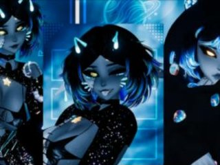
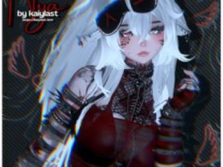
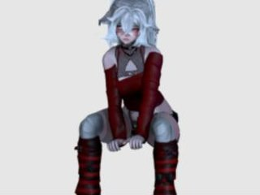
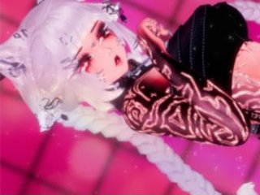
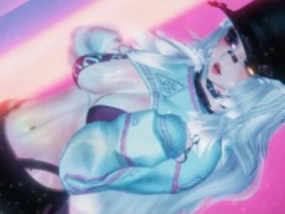
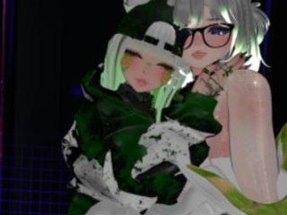
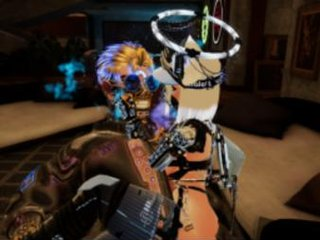
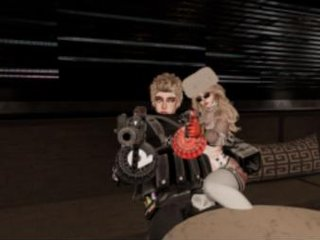
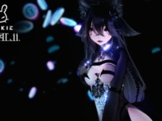

# Avatar upload tracker · 2026-10-09

Unity Unicorn keeps this list of which avatars are uploaded to which VRChat account, and in which versions. Update it after every upload and on every routine scan.

**Accounts**
- **findノastra**: the main account. Read on 2026-10-09 from the VRChat website, signed in through the Claude app's browser.
- **aiノastra**: the second account. Read on 2026-10-09 from the VRChat SDK Content Manager in Unity.

**Licensing rule:** When an avatar's licence might not allow uploads to more than one account, upload it to **findノastra** first and only. Meep's terms (Khihani) are strict, so Meep stays on findノastra.

**Key**
- ✅ uploaded
- ❌ not uploaded
- — no package for this variant
- **Impostor**: VRChat's auto-generated stand-in that shows when the real avatar is hidden. It isn't the same thing as a *fallback* avatar.
- **Fallback**: an avatar you've set as your fallback. This needs a Good or better Quest rank, and none of the current uploads qualify, so the column shows ❌ everywhere for now.
- Perf: PC / Quest performance rank (VP = Very Poor).

## Uploaded avatars

| Pic | Avatar | Variant | Account | PC | Quest | Impostor | Fallback | Perf (PC / Quest) | Last updated |
|---|---|---|---|---|---|---|---|---|---|
|  | Poppy | 7 VRCFT | aiノastra | ✅ | ❌ | ❌ | ❌ | VP / — | 2026-10-09 |
|  | Poppy | 6 VRCFT | findノastra | ✅ | ✅ | ❌ | ❌ | VP / VP | 2026-09-05 |
|  | Poppy | BIRTHDAY | findノastra | ✅ | ❌ | ✅ | ❌ | VP / — | 2026-09-05 |
|  | Meep | VRCFT | findノastra | ✅ | ❌ | ✅ | ❌ | VP / — | 2026-10-01 |
|  | Nya | VRCFT | findノastra | ✅ | ✅ | ✅ | ❌ | VP / VP | 2026-09-05 |
|  | Nya | OPTI | findノastra | ✅ | ✅ | ✅ | ❌ | Good / VP | 2026-09-05 |
|  | Obsi | VRCFT | findノastra | ✅ | ✅ | ✅ | ❌ | VP / VP | 2026-09-05 |
|  | Obsi | OPTI | findノastra | ✅ | ✅ | ✅ | ❌ | Medium / VP | 2026-09-05 |
|  | Fae | VRCFT | findノastra | ✅ | ✅ | ✅ | ❌ | VP / VP | 2026-09-05 |
|  | Leilin | VRCFT | findノastra | ✅ | ✅ | ✅ | ❌ | VP / VP | 2026-09-05 |
|  | Tisha | VRCFT | findノastra | ✅ | ❌ | ✅ | ❌ | VP / — | 2026-09-05 |
|  | Ryuu | — | findノastra | ✅ | ❌ | ✅ | ❌ | VP / — | 2026-09-05 |
|  | Zhora | — | findノastra | ✅ | ❌ | ❌ | ❌ | VP / — | 2026-09-05 |
|  | Onyx | — | findノastra | ✅ | ✅ | ❌ | ❌ | VP / VP | 2026-03-14 |
|  | Anarchy | — | findノastra | ✅ | ❌ | ✅ | ❌ | VP / — | 2025-08-27 |
|  | Akalii | — | findノastra | ✅ | ❌ | ✅ | ❌ | VP / — | 2025-08-12 |

All 16 uploads are **private**.

**Pictures:** These are the VRChat thumbnails, saved in `art/avatars/`. Poppy always uses Astra's chosen Poppy picture, and Poppy 7 VRCFT's VRChat thumbnail was changed to it on 2026-10-09. Fae always uses Astra's chosen Fae picture (set 2026-10-09). Fae [VRCFT]'s thumbnail on VRChat still shows the Poppy picture until Fae is next uploaded. ⚠️ **Leilin [VRCFT]** on VRChat also uses the Poppy picture and needs its own.

## Opti versions

| Avatar | Opti package on drive | Opti uploaded |
|---|---|---|
| Nya | ✅ PC Optimized | ✅ findノastra |
| Obsi | ✅ Optimized v1.0 | ✅ findノastra |
| Rynan | ✅ FT OPTI | ❌ |
| Tayag | ✅ OPTI FT | ❌ |
| Poppy, Fae, Leilin, Meep, Onyx, Yami, Yukio | — none found | ❌ |

## Needs uploading (to-do)

1. **Meep**: Quest/Android version (findノastra only, licence). The package says to upload PC first, then Android, from one project.
2. **Poppy 7 VRCFT**: Quest version, and a findノastra copy if wanted (Poppy 6 is the latest there).
3. **Rynan** and **Tayag**: OPTI FT + Quest FT packages are on the drive, but neither is uploaded yet.
4. **Yami**, **Yukio**, **Kasha (deadkitty)**, **Labubu**: packages on the drive, not uploaded.
5. **Balloon Cat (うかぶネコ)**: downloaded 2026-10-09. Edits planned before upload.
6. Quest versions are missing for Tisha, Ryuu, Zhora, Anarchy, Akalii and Poppy BIRTHDAY, if a Quest package exists.
7. Impostors are missing for Poppy 6, Poppy 7, Zhora and Onyx.

## Not matched to a local folder yet

Tisha, Zhora, Anarchy and Akalii are uploaded, but their packages weren't found in the avatar asset library. The routine scan should look for them.
